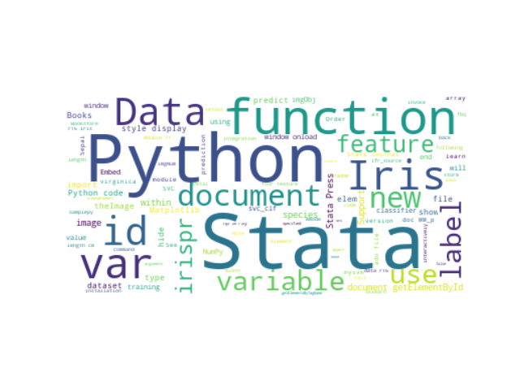

# Stata Python integration

##  [Hua Peng@StataCorp][hpeng]
### 2019 Stata User Conference Chicago 
### [https://tinyurl.com/y3h35tt3](https://huapeng01016.github.io/chicago19/)

# Stata 16 introduces tight integration with Python

- Embed and execute Python code 
- Use Python interactively
- Define and use Python routines in do-files 
- Define and use Python routines in ado-files
- Interact with Stata through Stata Function Interface (sfi)

# Use Python interactively

## **Hello World!**

~~~~
<<dd_do>>
python:
print('Hello World!')
end
<</dd_do>>
~~~~

## **for** loop

Just as when using Python directly, indentation is important when entering Python code in Stata.

~~~~
<<dd_do>>
python:
sum = 0
for i in range(7):
    sum = sum + i 
print(sum) 
end
<</dd_do>>
~~~~

## **sfi** 

~~~~
<<dd_do>>
python:
from functools import reduce
from sfi import Data, Macro

stata: quietly sysuse auto, clear

sum = reduce((lambda x, y: x + y), Data.get(var='price'))

Macro.setLocal('sum', str(sum))
end
display "sum of var price is : `sum'"
<</dd_do>>
~~~~

## More **sfi** 

~~~~
<<dd_do>>
python:
sum1 = reduce((lambda x, y: x + y), Data.get(var='rep78'))
sum1
sum2 = reduce((lambda x, y: x + y), Data.get(var='rep78', selectvar=-1))
sum2
end
<</dd_do>>
~~~~

# Use Python packages

* Pandas
* Numpy
* BeautifulSoup, lxml
* Matplotlib
* Scikit-Learn, Tensorflow, Keras
* NLTK

# 3D surface plot

## Import Python packages 

~~~~
<<dd_do>>
python:
import numpy as np
from sfi import Platform

import matplotlib
if Platform.isWindows():
	matplotlib.use('TkAgg')

import matplotlib.pyplot as plt
from mpl_toolkits import mplot3d
from sfi import Data
end
<</dd_do>>
~~~~

## Get data with **sfi.Data**

We use the Stata **sandstone** example dataset.

~~~~
<<dd_do>>
use https://www.stata-press.com/data/r16/sandstone, clear
* Use sfi to get data from Stata
python:
D = np.array(Data.get("northing easting depth"))
end
<</dd_do>>
~~~~

## Draw suface plot

We use a triangular mesh to produce the graph.   

~~~~
python:
ax = plt.axes(projection='3d')
plt.xticks(np.arange(60000, 90001, step=10000))
plt.yticks(np.arange(30000, 50001, step=5000))
ax.plot_trisurf(D[:,0], D[:,1], D[:,2], cmap='viridis', edgecolor='none')
plt.savefig("sandstone.png")
end
~~~~

<<dd_do:quietly>>
python:
ax = plt.axes(projection='3d')
plt.xticks(np.arange(60000, 90001, step=10000))
plt.yticks(np.arange(30000, 50001, step=5000))
ax.plot_trisurf(D[:,0], D[:,1], D[:,2], 
	cmap='viridis', edgecolor='none')
plt.savefig("sandstone.png")
end
<</dd_do>>

## Output

## Change color map and view anagle

~~~~
python:
ax.plot_trisurf(D[:,0], D[:,1], D[:,2], 
	cmap=plt.cm.Spectral, edgecolor='none')
ax.view_init(30, 60)
plt.savefig("sandstone1.png")
end
~~~~

<<dd_do:quietly>>
python:
ax.plot_trisurf(D[:,0], D[:,1], D[:,2], cmap=plt.cm.Spectral, edgecolor='none')
ax.view_init(30, 60)
plt.savefig("sandstone1.png")
end
<</dd_do>>

## Output

## Animation ([do-file](./stata/gif3d.do))

# Web scraping 

## Get HTML tables with **pandas**

We scrape [Nasdaq 100 stock tickers](https://en.wikipedia.org/wiki/NASDAQ-100) with **pandas**.

~~~~
python:
import pandas as pd
data = pd.read_html("https://en.wikipedia.org/wiki/NASDAQ-100")
df = data[2]
df = df.drop(df.index[0])
t = df.values.tolist()
end
~~~~

## Put results into a Stata dataset

~~~~
python:
from sfi import Data
Data.addObs(len(t))
stata: gen company = ""
stata: gen ticker = ""
Data.store(None, range(len(t)), t)
end
~~~~

## Result

<<dd_do: quietly>>
use stata/nas100ticker.dta, clear
<</dd_do>>

~~~~
<<dd_do>>
list in 1/5, clean
<</dd_do>>
~~~~

## Parse HTML with **lxml**

We use a [Python script](./stata/nas1detail.py) to get detailed information of 
a Nasdaq 100 stock, for example [ATVI](http://www.nasdaq.com/symbol/ATVI).

## Call Python script with arguments

~~~~
use nas100ticker, clear
quietly describe
frame create detail
forvalues i = 1/`r(N)' {
	local a = ticker[`i']
	local b detail
	python script nas1detail.py, args(`a' `b')
	sleep 100
}
frame detail : save nasd100detail.dta, replace
~~~~

## Result

<<dd_do: quietly>>
use stata/nasd100detail.dta, clear
<</dd_do>>

~~~~
<<dd_do>>
list ticker open_price open_date close_price close_date in 1/5, clean
<</dd_do>>
~~~~

# Support Vector Machine (SVM)

## **pysvm** ([ado file](./stata/pysvm.ado))

~~~~
program pysvm
	version 16
	syntax varlist, predict(name)
	gettoken label feature : varlist
	python: dosvm("`label'", "`feature'", "`predict'")
end
~~~~

## Python routine in [ado file](./stata/pysvm.ado)

~~~~
python:
from sfi import Data
import numpy as np
from sklearn.svm import SVC

def dosvm(label, features, predict):
	X = np.array(Data.get(features))
	y = np.array(Data.get(label))

	svc_clf = SVC(gamma='auto')
	svc_clf.fit(X, y)

	y_pred = svc_clf.predict(X)

	Data.addVarByte(predict)
	Data.store(predict, None, y_pred)

end
~~~~

## Test on **auto** dataset

<<dd_do: quietly>>
adopath + ./stata
<</dd_do>>

~~~~
<<dd_do>>
sysuse auto
pysvm foreign mpg price, predict(for2)
<</dd_do>>
~~~~

## Compare

~~~~
<<dd_do>>
label values for2 origin
tabulate foreign for2, nokey
<</dd_do>>
~~~~

## Upgrade 

<<dd_do: quietly>>
sysuse auto, clear
set seed 12345
<</dd_do>>

~~~~
<<dd_do>>
pysvm2 foreign mpg price if runiform() <= 0.2
pysvm2predict for2
<</dd_do>>
~~~~

## Output

~~~~
<<dd_do>>
label values for2 origin
tabulate foreign for2, nokey
<</dd_do>>
~~~~

## Train program ([pysvm2.ado](./stata/pysvm2.ado))

~~~~
program pysvm2
	version 16
	syntax varlist(min=3) [if] [in] 
	gettoken label features : varlist
	marksample touse
	qui count if `touse'
	if r(N) == 0 {
		di as error "no observations"
		exit 2000
	}
	
	qui summarize `label' if `touse' 
	if r(min) >= r(max) {
		di as error "outcome does not vary"
		exit 2000
	}
	
	quietly python: dosvm2("`label'", "`features'", "`touse'")	
	di as text "note: training finished successfully"
end
~~~~

## Python routine in [pysvm2.ado](./stata/pysvm2.ado)

~~~~
python:
import sys
from sfi import Data, Macro
import numpy as np
from sklearn.svm import SVC
import __main__

def dosvm2(label, features, select):
	X = np.array(Data.get(features, selectvar=select))
	y = np.array(Data.get(label, selectvar=select))

	svc_clf = SVC(gamma='auto')
	svc_clf.fit(X, y)
	
	__main__.svc_clf = svc_clf 
	Macro.setGlobal('e(svm_features)', features)
	return svc_clf
end
~~~~

## Predict program ([pysvm2predict.ado](./stata/pysvm2predict.ado))

~~~~
program pysvm2predict
	version 16
	syntax anything [if] [in]

	gettoken newvar rest : anything
	if "`rest'" != "" {
		exit 198
	}
	confirm new variable `newvar'	
	marksample touse
	qui count if `touse'
	if r(N) == 0 {
		di as text "zero observations"
		exit 2000
	}

	qui replace `touse' = _n if `touse' != 0 	
	python: dosvmpredict2("`newvar'", "`touse'")
end
~~~~

## Python routine in [pysvm2predict.ado](./stata/pysvm2predict.ado)

~~~~
python:
import sys
from sfi import Data, Macro
import numpy as np
from sklearn.svm import SVC
from __main__ import svc_clf

def dosvmpredict2(predict, select):
	features = select + " "+ Macro.getGlobal('e(svm_features)')
	X = np.array(Data.get(features, selectvar=select))

	y_pred = svc_clf.predict(X[:,1:])
	y1 = np.reshape(y_pred, (-1,1))

	y = np.concatenate((X, y1), axis=1)
	Data.addVarDouble(predict)
	dim = y.shape[0]
	j = y.shape[1]-1
	for i in range(dim):
		Data.storeAt(predict, y[i,0]-1, y[i,j])
	
end
~~~~

# Pass Python object between ado files

##

In [pysvm2.ado](./stata/pysvm2.ado) ado code:

~~~~
...
import __main__ 
...
__main__.svc_clf = svc_clf
...
~~~~

## 
To access **svc_clf** in Python routines in ado files: 

~~~~
...
from __main__ import svc_clf
...
~~~~

# Thanks!

# Post-credits...

- [sfi details and examples][sfi] 
- [Stata Python documentation][P python]
- [Stata Python integration](https://www.stata.com/new-in-stata/python-integration/)
- The talk is made with [Stata markdown](https://www.stata.com/features/overview/markdown/) and [dynpandoc](https://ideas.repec.org/c/boc/bocode/s458455.html)
- [wordcloud do-file](./stata/words.do)

[hpeng]: hpeng@stata.com
[sfi]: https://www.stata.com/python/api16/
[P python]:https://www.stata.com/manuals/ppython.pdf
